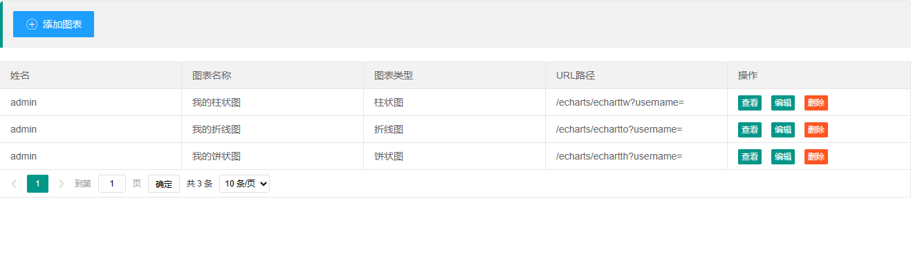
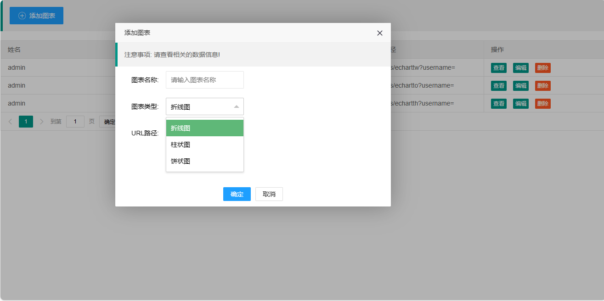
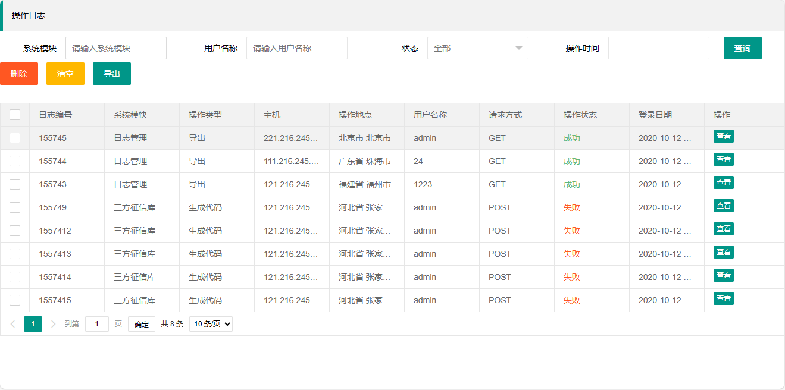
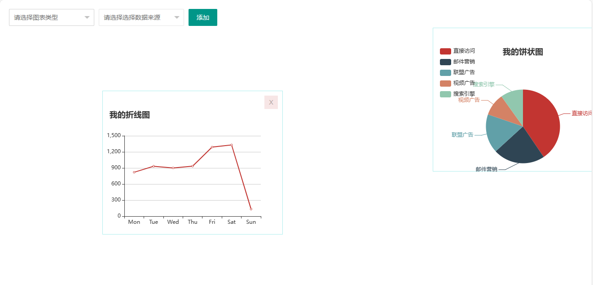

<h1 align="center">24.基于springboot的Echarts管理系统</h1>

 获取sql文件 QQ: 386869957 QQ群: 377586148 

 [推荐站点: 从戎源码网](https://armycodes.com/) 

## 简介

> 本代码来源于网络,仅供学习参考使用!
>
> 提供1.远程部署/2.修改代码/3.设计文档指导/4.框架代码讲解等服务
>
> 前台首页地址: 
> http://localhost:8080/static/operationLog.html
> http://localhost:8080/static/index2.html
> http://localhost:8080/static/indexListA.html
>

## 项目介绍

基于springboot的Echarts管理系统：一个echarts使用的实例系统、可以在网页上添加自己的图表、拖动图表位置进行布局

## 主要功能：

- 图表管理：添加图表、图表列表展示、图表查看、图表信息编辑、图表删除
- 图表布局：选框添加图表、拖动图表、删除布局中的图表
- 操作日志：条件查询、日志列表、删除日志、导出日志、查看日志详情

## 环境

- <b>IntelliJ IDEA 2021.3</b>

- <b>Mysql 5.7.26</b>

- <b>Tomcat 7.0.73</b>

- <b>JDK 1.8</b>

## 运行截图

